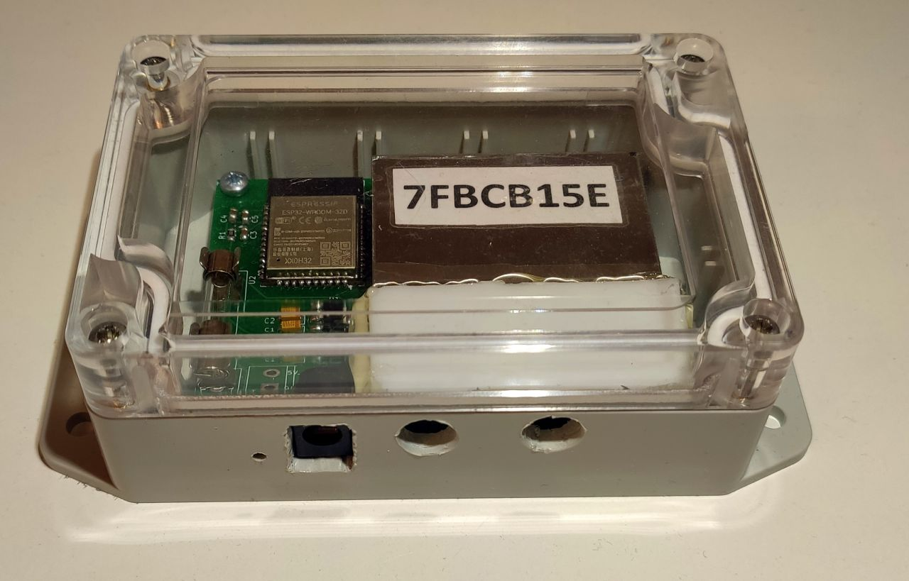
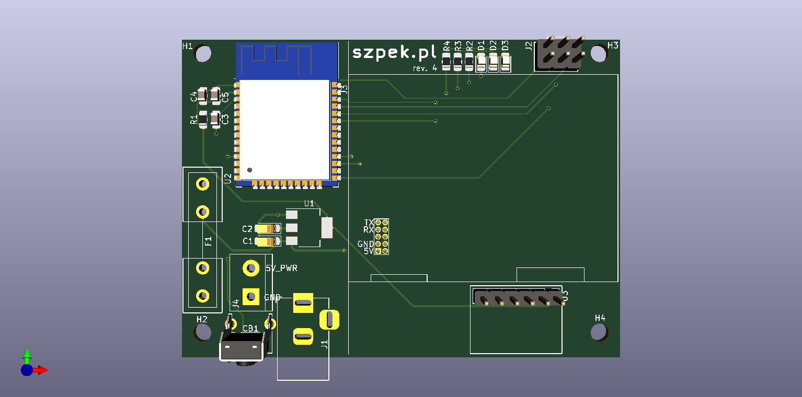

# SzpekESP32

**[Szpek](https://www.szpek.pl) is a smog sensor network project which monitors air pollution in the cities.**

This repository contains firmware for "Szpek" sensor device.  
It uses official [ESP-IDF](https://docs.espressif.com/projects/esp-idf/en/latest/esp32/) framework for programming ESP32 chips, which is based on [FreeRTOS](https://www.freertos.org/).

**Build status:** 

[User guide for sensor device (PL)](https://www.szpek.pl/manual)

## Details
Sensor device collects measurements and sends them to the service hosted in the cloud.  
Repositories for backend application and Web UI interface can be found here:
- [Backend service](https://github.com/wojciechN9/Szpek)
- [Web UI interface](https://github.com/wojciechN9/Szpek-UI)

A sensor device was built using:
- [ESP32-WROOM-32D](https://www.espressif.com/en/products/socs/esp32)  system-on-chip,
- [Plantower PMS7003](https://www.plantower.com/en/products_33/76.html) module for smog measurement,
- [Bosch BME280](https://www.bosch-sensortec.com/products/environmental-sensors/humidity-sensors-bme280/) sensor for humidity, temperature and pressure measurements.
- [Kradex Z128](https://www.kradex.com.pl/product/obudowy_hermetyczne/z128uj_tm_abs?lang=pl) case,
- PCB designed in [KiCad](https://www.kicad.org/) software.

## Photos

## License

SzpekESP32 is [licensed](LICENSE.md) under the [Apache License v2.0](https://www.apache.org/licenses/LICENSE-2.0) modified with [Commons Clause Restriction](https://commonsclause.com/).

**Sensor device, firmware and PCB was designed and manufactured by [Szymon Katra](https://github.com/SzymonKatra)**.  
**Backend service and Web UI interface was created by [Wojciech Nastaj](https://github.com/wojciechN9)**.
